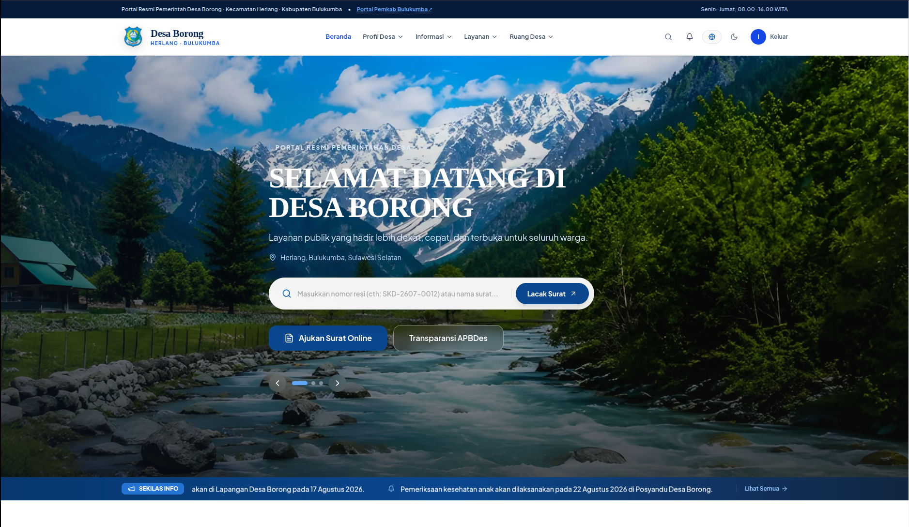
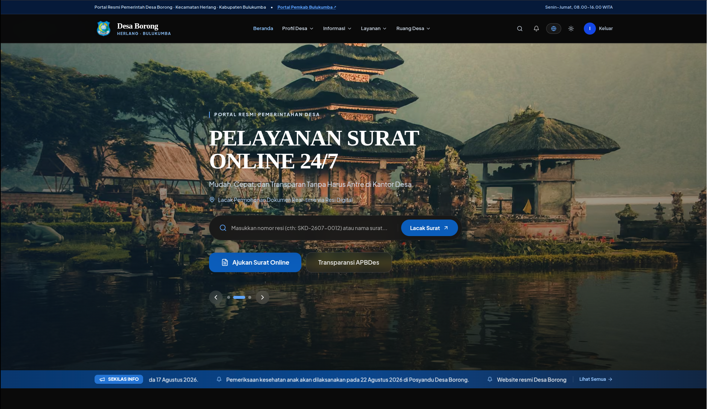
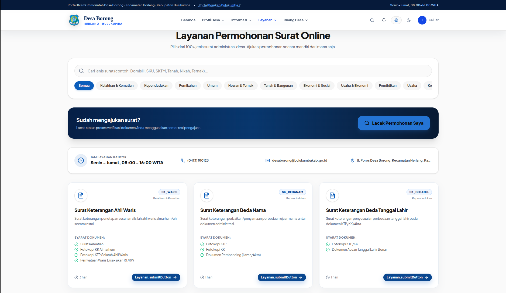
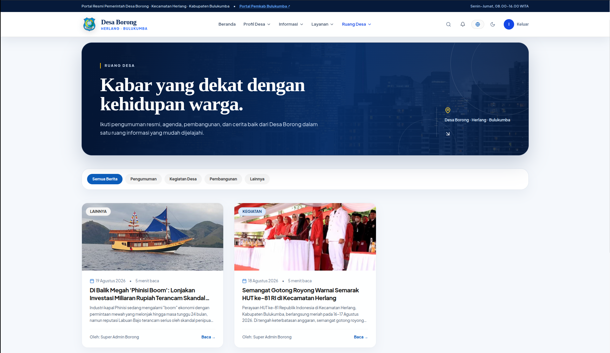
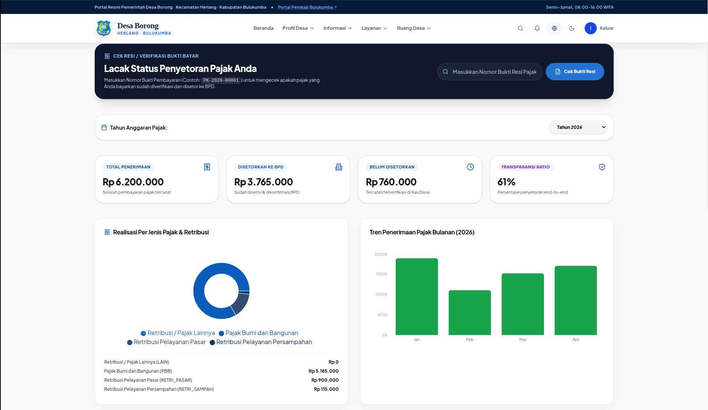
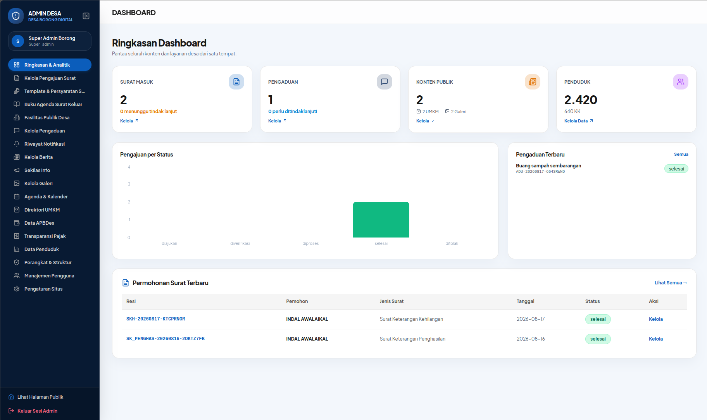

<div align="center">

# Sistem Informasi Desa Borong

### Portal Layanan Publik, Transparansi, dan Administrasi Desa Berbasis Web

<p align="center">
  
  
  
  
  
  
  
  
</p>

<p align="center">
  <a href="#fitur-unggulan">Fitur Utama</a> •
  <a href="#galeri-antarmuka">Galeri Antarmuka</a> •
  <a href="#arsitektur">Arsitektur</a> •
  <a href="#menjalankan-aplikasi-secara-lokal">Instalasi Lokal</a> •
  <a href="#dokumentasi-pendukung">Dokumentasi</a>
</p>

</div>

---

Sistem Informasi Desa Borong adalah platform digital terpadu yang dirancang untuk menghadirkan transparansi pemerintahan, kecepatan layanan administrasi kependudukan dan persuratan, serta keterbukaan informasi publik bagi warga **Desa Borong, Kecamatan Herlang, Kabupaten Bulukumba, Sulawesi Selatan**.

Proyek ini dibangun dengan pendekatan **Clean Architecture** pada sisi backend dan teknologi frontend modern untuk memastikan performa tinggi, keamanan data yang ketat, serta pengalaman pengguna yang nyaman baik bagi warga maupun perangkat desa.

Sistem melayani dua sisi pengguna utama:

- **Pengunjung umum** — melihat profil desa, statistik kependudukan, APBDes, agenda, fasilitas, berita, galeri, UMKM, pajak, peta lokasi, layanan persuratan, dan dapat memasang situs sebagai aplikasi (PWA).
- **Admin/operator desa** — mengelola konten, verifikasi surat, pengaduan warga, data penduduk, pembukuan pajak, keuangan, notifikasi, dan konfigurasi sistem.

---

## Daftar Isi

1. [Tujuan Sistem](#tujuan-sistem)
2. [Galeri Antarmuka](#galeri-antarmuka)
3. [Fitur Unggulan](#fitur-unggulan)
4. [Arsitektur](#arsitektur)
5. [Teknologi yang Digunakan](#teknologi-yang-digunakan)
6. [Struktur Direktori Repository](#struktur-direktori-repository)
7. [Persyaratan Sistem](#persyaratan-sistem)
8. [Konfigurasi Environment](#konfigurasi-environment)
9. [Menjalankan Aplikasi Secara Lokal](#menjalankan-aplikasi-secara-lokal)
10. [Pengelolaan Database](#pengelolaan-database)
11. [API dan Integrasi](#api-dan-integrasi)
12. [CI/CD](#cicd)
13. [Pengembangan Fitur](#pengembangan-fitur)
14. [Keamanan dan Best Practice](#keamanan-dan-best-practice)
15. [Troubleshooting](#troubleshooting)
16. [Dokumentasi Pendukung](#dokumentasi-pendukung)
17. [Kontribusi](#kontribusi)
18. [Lisensi](#lisensi)

---

## Tujuan Sistem

- Menyediakan portal informasi digital desa yang mudah diakses oleh publik.
- Menyederhanakan pengelolaan data desa secara terstruktur dan terpusat.
- Memungkinkan pengajuan dan pelacakan layanan persuratan warga secara digital, tanpa antre di kantor desa.
- Meningkatkan transparansi keuangan dan pajak desa melalui data yang terbuka dan mudah dipahami.
- Memudahkan admin desa dalam mengelola konten, data warga, dan proses administrasi harian.

---

## Galeri Antarmuka

Berikut pratinjau tampilan antarmuka Sistem Informasi Desa Borong.

### Halaman Beranda

Portal utama yang menyambut pengunjung dengan informasi penting, statistik kependudukan real-time, ticker informasi, serta akses cepat ke berbagai layanan publik.

<p align="center">
  
</p>
<p align="center">
  
</p>

### Layanan Persuratan Online

Memungkinkan warga mengajukan surat keterangan atau pengantar secara online tanpa harus datang ke kantor desa, lengkap dengan fitur pelacakan status permohonan.

<p align="center">
  
</p>

### Portal Berita dan Informasi Desa

Pusat publikasi kegiatan desa, pengumuman resmi, agenda kegiatan, galeri foto, serta direktori UMKM lokal untuk mendukung ekonomi warga.

<p align="center">
  
</p>

### Transparansi Pajak dan Keuangan APBDes

Wujud nyata akuntabilitas publik, di mana warga dapat memantau realisasi Anggaran Pendapatan dan Belanja Desa (APBDes) serta status kepatuhan pajak secara transparan.

<p align="center">
  
</p>

### Dashboard Administrator dan Manajemen Desa

Panel kendali eksklusif bagi perangkat desa untuk mengelola verifikasi surat, pengaduan warga, pembukuan pajak, manajemen berita, dan rekapitulasi data penduduk secara terpusat.

<p align="center">
  
</p>

---

## Fitur Unggulan

- **Modern Tech Stack** — Dibangun dengan Next.js 16 App Router, React 19, TypeScript, Tailwind CSS 4, dan backend Go 1.26 berperforma tinggi.
- **Progressive Web App (PWA)** — Dapat dipasang langsung di perangkat seluler layaknya aplikasi native, dengan dukungan offline caching melalui service worker.
- **Notifikasi Realtime (SSE)** — Pemberitahuan instan via Server-Sent Events untuk pembaruan status surat dan pengaduan warga tanpa perlu me-refresh halaman.
- **Autentikasi Aman** — Kombinasi JWT access token berumur pendek (15 menit) dan refresh token terenkripsi dengan rotasi otomatis serta kemampuan pencabutan.
- **Job Worker Asinkron** — Pengiriman email (Brevo), WhatsApp (FlowKiris), pembuatan PDF, dan pembersihan data diproses secara background, tidak membebani request-response.
- **Optimasi Gambar Otomatis** — Menggunakan Next.js Image Optimization dengan `sharp`, mengonversi gambar ke AVIF/WebP dan melakukan resize responsif.
- **Tema Adaptif (Dark/Light)** — Mendukung mode terang dan gelap secara mulus, dengan preferensi pengguna tersimpan melalui Zustand.
- **Internasionalisasi (i18n)** — Siap digunakan dalam Bahasa Indonesia maupun Bahasa Inggris.
- **Peta Interaktif** — Menampilkan lokasi fasilitas dan wilayah desa menggunakan Leaflet dan react-leaflet.
- **Visualisasi Data Interaktif** — Grafik statistik kependudukan dan keuangan menggunakan Recharts.
- **Audit Trail** — Riwayat perubahan tercatat pada modul transaksional seperti pajak dan persuratan.

---

## Arsitektur

Sistem ini memisahkan tanggung jawab secara ketat melalui struktur monorepo, dengan tiga lapisan utama:

| Layer | Isi |
|---|---|
| Frontend | Next.js (App Router), React, Tailwind CSS, Zustand, komponen UI reusable |
| Application | Backend Go REST API, usecase/domain logic, routing HTTP (`net/http`) |
| Data | MySQL, migrasi skema, repository (sqlc), file storage, background job |

Alur kerja secara singkat:

```
Browser / Client
     │
     ▼
Frontend (Next.js 16) ──(proxy /api/*)──► Backend Go REST API (Clean Architecture)
     ▲                                              │
     │             notifikasi realtime (SSE)        ▼
     └──────────────────────────────────  MySQL 8.4 LTS / File Storage
```

- **Frontend (`/Frontend`)** menangani antarmuka pengguna, rendering sisi server (SSR/SSG), serta manajemen state lokal. Seluruh pemanggilan API dilakukan melalui service layer di `Frontend/lib/services/`, bukan langsung dari komponen.
- **Backend (`/Backend`)** menyediakan REST API dengan Clean Architecture (*domain → usecase → infrastructure*), memastikan logika bisnis terisolasi dari framework HTTP maupun database.
- Request `/api/*` dan `/uploads/*` dari frontend di-proxy ke backend melalui jaringan internal Docker (`API_INTERNAL_URL`).
- Notifikasi realtime dikirim backend ke browser melalui Server-Sent Events pada endpoint `/api/notifikasi/stream`.

---

## Teknologi yang Digunakan

| Komponen | Teknologi Utama |
|---|---|
| Frontend | Next.js 16 (App Router), React 19, TypeScript 5, Tailwind CSS 4, PostCSS 8, Zustand 5, Zod 3, Lucide React, Recharts, Leaflet/react-leaflet, `sharp`, ESLint 9, Vitest 3, Testing Library |
| Backend | Go 1.26, `net/http` (stdlib), sqlc, golang-migrate, `golang-jwt/jwt/v5`, bcrypt (`golang.org/x/crypto`), `log/slog`, testify |
| Database & Infra | MySQL 8.4 LTS, Docker & Docker Compose, GitHub Actions CI/CD |

---

## Struktur Direktori Repository

```text
.
├── Frontend/                 # Aplikasi Next.js 16 (App Router)
│   ├── app/
│   │   ├── (public)/         # Rute publik: /profil, /berita, /informasi/*, /layanan, /pengaduan, /umkm, /login, /register, ...
│   │   └── (dashboard)/      # Rute admin: /dashboard/{agenda,berita,pajak,pengajuan,pengaduan,...}
│   ├── components/           # Komponen UI reusable, layout, fitur, dan modul persuratan
│   ├── lib/                  # Service API, mock data, i18n, helper, validasi
│   ├── store/                # Zustand store (auth, ui, toast, notifikasi)
│   ├── types/ & messages/    # Tipe TypeScript & berkas i18n
│   ├── public/               # Aset statis, service worker (sw.js), manifest PWA
│   ├── vitest.config.ts      # Konfigurasi pengujian (Vitest + Testing Library)
│   └── Dockerfile
├── Backend/                  # REST API Go (Clean Architecture)
│   ├── cmd/api/main.go       # Entrypoint: load config, wiring, start server
│   ├── internal/
│   │   ├── delivery/http/    # Router, middleware, handler, apiresponse
│   │   ├── domain/           # Entity & error domain
│   │   ├── usecase/          # Logika bisnis (auth, berita, desa, finance, galeri, pajak, pengaduan, persuratan, umkm, user, ...)
│   │   ├── infrastructure/   # Repository MySQL (sqlc), auth, config, email, whatsapp, job, storage
│   │   └── pkg/              # Util internal (apputil, notif)
│   ├── pkg/                  # pdfengine, security, templateengine
│   ├── migrations/           # Skema migrasi database (golang-migrate)
│   ├── scripts/backup.sh     # Skrip backup database otomatis
│   ├── sqlc.yaml, go.mod, go.sum
│   └── Dockerfile
├── docs/
│   └── images/                # Aset tangkapan layar antarmuka sistem
├── docker-compose.yml         # Konfigurasi orkestrasi Docker (mysql + migrate + backend + frontend)
├── .env / .env.example         # Template environment untuk Docker
├── .github/workflows/ci.yml    # Pipeline CI/CD
└── LICENSE                     # MIT (c) 2026 Indal Awalaikal
```

---

## Persyaratan Sistem

- [Docker](https://www.docker.com/) & Docker Compose
- Node.js 22+ dan npm (jika ingin menjalankan frontend secara lokal tanpa Docker)
- Go 1.26+ (jika ingin menjalankan backend secara lokal tanpa Docker)
- `openssl` (opsional, untuk membuat secret JWT)

---

## Konfigurasi Environment

Proyek ini memiliki tiga berkas environment sesuai konteks penggunaannya:

| Lokasi | Untuk | Catatan |
|---|---|---|
| `.env.example` (root) | Docker Compose | Template utama; salin ke `.env` |
| `Backend/.env.example` | Backend Go lokal | Gunakan `DB_HOST=localhost` |
| `Frontend/.env.example` | Frontend lokal | Gunakan `API_INTERNAL_URL=http://localhost:8080` |

Salin setiap template terlebih dahulu, kemudian isi nilainya, terutama kredensial database dan secret JWT. Untuk secret, disarankan menggunakan:

```bash
openssl rand -base64 32
```

---

## Menjalankan Aplikasi Secara Lokal

### Opsi 1 — Docker Compose (seluruh sistem)

Cara tercepat dan paling direkomendasikan untuk menjalankan seluruh layanan sekaligus.

```bash
cp .env.example .env     # isi DB_PASSWORD, DB_ROOT_PASSWORD, JWT_ACCESS_SECRET, dst.
docker compose up --build -d
```

| Layanan | URL |
|---|---|
| Frontend (warga & admin) | http://localhost:3300 |
| Backend REST API | http://localhost:8088 |
| Database MySQL | localhost:3306 |

Melihat log layanan:

```bash
docker compose logs -f backend
docker compose logs -f frontend
docker compose logs -f mysql
```

Menghentikan layanan:

```bash
docker compose down            # hentikan kontainer
docker compose down -v         # hentikan kontainer sekaligus hapus volume data database
```

### Opsi 2 — Backend secara lokal (Go)

```bash
cd Backend
cp .env.example .env          # sesuaikan, DB_HOST=localhost
go mod tidy
go run ./cmd/api
```

Backend akan berjalan di `http://localhost:8080` (atau sesuai `APP_PORT` pada `.env`).

### Opsi 3 — Frontend secara lokal (Next.js)

```bash
cd Frontend
npm install
npm run dev
```

Frontend akan berjalan di `http://localhost:3000` dan otomatis me-rewrite `/api/*` ke `http://localhost:8080`.

---

## Pengelolaan Database

Berkas migrasi berada di `Backend/migrations` dan dijalankan otomatis oleh service `migrate` saat `docker compose up`. Untuk menjalankannya secara manual:

```bash
docker compose up -d mysql                 # jalankan MySQL terlebih dahulu
docker compose run --rm migrate            # jalankan migrasi up
```

Mereset database dari awal:

```bash
docker compose down -v
docker compose up --build -d
```

Backup database otomatis (mengikuti konfigurasi pada `.env`):

```bash
cd Backend && bash scripts/backup.sh
# hasil tersimpan di: Backend/backups/desa_borong_<timestamp>.sql.gz
```

Untuk meregenerasi kode query type-safe dengan sqlc setelah mengubah skema atau query, jalankan `sqlc generate` (lihat `Backend/sqlc.yaml`).

---

## API dan Integrasi

Backend menyediakan REST API yang diakses frontend melalui service layer di `Frontend/lib/services`. Seluruh request dikelompokkan dan dipetakan secara konsisten — frontend tidak pernah mengakses data langsung dari dalam komponen, semua panggilan melewati lapisan abstraksi service.

Endpoint utama meliputi:

- **Auth** — login, logout, refresh token, profil pengguna
- **Berita** — publikasi dan pengelolaan berita desa
- **Profil & Desa** — data profil, statistik, dan informasi wilayah
- **Persuratan** — daftar jenis surat, pengajuan, pembaruan status, unggah lampiran
- **Pengaduan** — pengajuan dan penanganan pengaduan warga
- **Pajak** — jenis pajak, wajib pajak, transaksi, penyetoran batch, konfirmasi, dan ringkasan

Error API diproses secara konsisten melalui helper response (`apiresponse`) dengan format envelope standar, dan notifikasi realtime dikirim melalui SSE pada `/api/notifikasi/stream`.

Spesifikasi lengkap endpoint tersedia pada `Backend/SPEC.md`.

---

## CI/CD

Pipeline GitHub Actions dikonfigurasi pada `.github/workflows/ci.yml` dengan tiga job utama:

- **backend** — `setup-go@v5` (Go 1.26) → `go mod download` → `go vet ./...` → `go test ./...` → `go test -race ./...` (dengan service MySQL 8.4 sebagai dependency test).
- **frontend** — `setup-node@v4` (Node 22, cache npm) → `npm ci` → type-check → lint.
- **docker** — build dan push image ke registry pada setiap push ke cabang `main`.

---

## Pengembangan Fitur

Panduan lengkap untuk kontributor tersedia di `Frontend/AGENTS.md` dan `Backend/AGENTS.md`, mencakup konvensi kode, pola arsitektur, dan Definition of Done. Ringkasannya:

1. Backend mengikuti Clean Architecture: *domain → usecase (port) → infrastructure (adapter)*. Wiring dependency hanya dilakukan di `cmd/api/main.go`.
2. Setiap perubahan skema database disertai migrasi (`up`/`down`) yang sesuai.
3. Tambahkan unit test usecase dan test handler (`go test -race ./...`), atau test komponen (`vitest run`) untuk perubahan pada frontend.
4. Setiap endpoint baru harus dilindungi middleware autentikasi/otorisasi (RBAC) yang sesuai.
5. Frontend: akses data melalui service layer, manajemen state melalui Zustand, validasi form melalui Zod.

---

## Keamanan dan Best Practice

- Seluruh rahasia (`JWT_ACCESS_SECRET`, `JWT_REFRESH_SECRET`, `DOCUMENT_HMAC_SECRET`, kredensial database) disimpan sebagai environment variable, tidak pernah di-hardcode.
- Password pengguna di-hash menggunakan bcrypt; JWT access token bersifat stateless dengan umur singkat; refresh token disimpan dalam bentuk hash di database, berotasi setiap kali dipakai, dan dapat dicabut kapan saja.
- Berkas unggahan pengguna disimpan pada volume Docker terpisah (`uploads`), tidak disertakan dalam repository.
- CORS dibatasi secara eksplisit melalui `CORS_ALLOWED_ORIGINS`.
- Modul transaksional seperti pajak dan persuratan memiliki audit trail atas setiap perubahan data.
- Seluruh query SQL dibuat secara eksplisit melalui sqlc, sehingga terhindar dari risiko SQL injection akibat string concatenation.

---

## Troubleshooting

| Masalah | Yang Perlu Diperiksa |
|---|---|
| Port 3300 / 8088 sudah dipakai | Hentikan service lain yang menggunakan port tersebut, atau ubah pemetaan port pada `docker-compose.yml` |
| MySQL tidak bisa start | Nilai `.env`, `DB_ROOT_PASSWORD`, kondisi volume `mysql_data`, dan status Docker |
| Backend gagal konek ke database | `DB_HOST`, `DB_PORT`, `DB_NAME`, `DB_USER`, `DB_PASSWORD`, serta status migrasi |
| Frontend tidak bisa memanggil API | `NEXT_PUBLIC_API_BASE_URL`, `API_INTERNAL_URL`, `CORS_ALLOWED_ORIGINS`, dan status backend |
| Build frontend gagal | Kesalahan TypeScript, alias import `@/`, atau environment variable yang belum tersedia saat build |
| Error JWT/login | Panjang `JWT_ACCESS_SECRET` (minimal 32 byte), format token, serta validitas dan rotasi refresh token |
| Error saat unggah berkas | `FILE_STORAGE_PATH`, izin akses folder, dan volume Docker `uploads` |

---

## Dokumentasi Pendukung

- **README ini** — gambaran umum proyek dan cara menjalankannya secara lokal.
- **`Backend/README.md`** — detail implementasi API dan arsitektur backend.
- **`Frontend/README.md`** — detail implementasi antarmuka dan fitur web.
- **`Backend/AGENTS.md`** — panduan bagi agent/kontributor backend (arsitektur, Definition of Done, tech stack).
- **`Frontend/AGENTS.md`** — panduan bagi agent/kontributor frontend.
- **`Backend/PRD.md`**, **`Backend/SPEC.md`**, **`Frontend/PRD.md`**, **`Frontend/SPEC.md`** — dokumen kebutuhan produk dan spesifikasi teknis.

---

## Kontribusi

Proyek ini dikembangkan oleh developer frontend, developer backend, admin/operator desa, dan stakeholder/product owner. Setiap perubahan yang diajukan wajib disesuaikan dengan dokumen produk dan spesifikasi teknis pada masing-masing folder, serta lolos pipeline CI (lint, test, dan race detection).

---

## Lisensi

Hak Cipta (c) 2026 **Indal Awalaikal**.

Proyek ini dilisensikan berdasarkan ketentuan **MIT License**. Lihat berkas [`LICENSE`](./LICENSE) untuk teks lengkapnya.